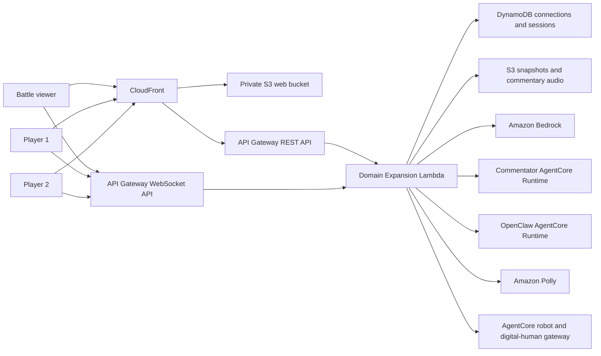

# Domain Expansion AR Game

Domain Expansion is the gesture-controlled multiplayer AR game in the
`aws-agentic-robotics` stack. The primary frontend lives in the
`domain-expansion-ar-game` Git submodule and the Lambda backend lives in
`domain-expansion-ar-game-serverless`.

## Runtime architecture



CloudFront is the single browser origin. `/api/*` and `/health` are routed to
the REST API while static files are served from the private S3 origin. Browser
camera streams remain peer-to-peer through WebRTC; API Gateway WebSocket carries
only authoritative game commands, snapshots of room state, and WebRTC
negotiation messages.

## Frontend surfaces

| Path | Purpose |
| --- | --- |
| `/` | Player camera, MediaPipe recognition, canvas VFX, score HUD, and solo mode |
| `/battle.html` | Authoritative two-player viewer, match controls, commentary, cinematics, and results |
| `/player.html` | Optional media popup controlled through origin-validated `postMessage` events |
| `/share.html` | Match snapshots, download, clipboard, and Web Share |

The UI is designed for desktop, iPad, and Android tablets. Camera and settings
controls are adjacent touch targets. Technique videos are bounded overlays, so
the player camera or both battle streams remain visible. Camera selection is
persisted and switches immediately while active; removed devices fall back to
the browser default camera.

## Authoritative match protocol

The wire protocol version is `2.0`. Each browser joins a room with a stable
client ID and one role: `viewer`, `player1`, or `player2`.

The backend owns:

- match phase and revision;
- challenge ordering and deadlines;
- score and attempt counts;
- controller authorization;
- reconnect snapshots;
- idempotent command processing;
- score-grace resolution and cinematic completion.

The viewer that starts a match is its controller. A match enters `preparing`
while opening commentary and optional snapshots are produced. The controller
starts the countdown only after opening commentary playback completes.

Recognition events carry a server-adjusted `recognizedAt` timestamp. The
backend rejects non-numeric timestamps, early recognition, excessive future
clock skew, delivery delay over 1.5 seconds, and recognition after the
challenge deadline. The viewer sends authoritative expiry commands so
background-throttled player tabs cannot stall a match.

## Commentary engines

The battle settings expose three explicit engines:

| Engine | Execution path |
| --- | --- |
| `strands_local` | Strands `Agent` inside the Lambda using the configured Bedrock model |
| `agentcore_runtime` | Dedicated Domain Expansion AgentCore Runtime |
| `openclaw` | OpenClaw AgentCore Runtime using its `main` agent |

There is no cross-engine fallback. If the selected engine fails, the request
fails and the UI displays the API error. Direct Bedrock remains available only
as the explicit internal `local_direct` mode used by local development.

OpenClaw model selection belongs to OpenClaw, not the game Lambda. The game
selects `OPENCLAW_AGENT_ID=main`; the OpenClaw runtime currently maps that agent
to `litellm/kimi-k2.5`. `BEDROCK_MODEL_ID=global.moonshotai.kimi-k3` configures
the Lambda Strands/direct path and the dedicated commentator runtime, not
OpenClaw.

The synchronous timeout chain is:

- CloudFront origin read timeout: 60 seconds;
- API Gateway integration timeout: 60 seconds;
- Lambda timeout: 55 seconds;
- AgentCore SDK read timeout: 50 seconds.

OpenClaw runtime sessions are isolated per game match while retaining a stable
actor/user identity. This prevents unrelated matches and Telegram traffic from
sharing one AgentCore runtime session.

When AWS TTS is selected, Lambda synthesizes the returned commentary with
Polly, stores the MP3 under the commentary audio prefix, and returns a
short-lived signed URL. Browser speech remains the other explicit TTS mode.

## Authentication and authorization

- The browser signs in through the shared Cognito user pool.
- Protected REST endpoints require a Cognito ID token.
- WebSocket `$connect` validates the token through the Lambda authorizer.
- Snapshot retrieval endpoints remain public so native image elements can load
  them, while writes and commentary generation remain authenticated.
- The Lambda role has scoped Bedrock, AgentCore, Polly, DynamoDB, S3, WebSocket,
  and AgentCore Gateway permissions.

## Local development

```bash
cd domain-expansion-ar-game
npm ci
npm run dev
```

Open:

- `https://localhost:5173/battle.html?room=BTL1`
- `https://localhost:5173/?room=BTL1&role=player1`
- `https://localhost:5173/?room=BTL1&role=player2`

The local coordinator implements the same match phases, recognition timestamp
rules, challenge expiry, and WebSocket envelopes as AWS.

## Deployment

Domain Expansion is part of the single `aws-agentic-robotics` CloudFormation
stack:

```bash
./deploy.sh --check-health --check-agentcore --check-timeout 60
```

The deployment script builds the frontend submodule, deploys the root CDK
stack, validates outputs, synchronizes the complete video set, and optionally
checks the website, API, and AgentCore runtime.

The authoritative outputs are:

- `domainExpansionServerlessUrl`
- `domainExpansionServerlessWebSocketUrl`
- `domainExpansionServerlessRestApiUrl`
- `domainExpansionCommentatorRuntimeArn`
- `DomainExpansionWebsiteBucket`

## Tests

From the repository root:

```bash
./scripts/lint.sh
./scripts/test-all.sh
```

Focused game validation:

```bash
npm --prefix domain-expansion-ar-game test
npm --prefix domain-expansion-ar-game run build
npm --prefix domain-expansion-ar-game run test:e2e:local
```

Trigger all deployed commentary engines through HTTPS:

```bash
npm --prefix domain-expansion-ar-game run test:commentary:aws
```

The AWS commentary test discovers the primary URL from CloudFormation, creates
a temporary Cognito user through the AWS SDK credential chain, invokes all
three engines, validates their responses and latency, and deletes the user in
`finally`.

## Operations and troubleshooting

- Primary stack: `aws-agentic-robotics`
- Lambda logs: the log group owned by
  `DomainExpansionServerlessConstruct/LambdaFunction`
- OpenClaw container logs: `/openclaw/container`
- OpenClaw API access logs: `/openclaw/api-access-dev`
- AgentCore runtime logs:
  `/aws/bedrock-agentcore/runtimes/<runtime-id>-DEFAULT`

For commentary failures, correlate the Lambda request ID with the selected
engine log. Do not infer success from Telegram webhook latency: Telegram
acknowledges the webhook before its AgentCore generation finishes.
